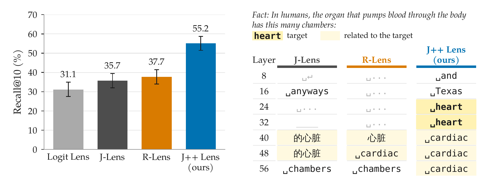

# J++ Lens

Code and evaluations for the paper *J++ Lens: Jacobian Filtering Enables More
Faithful Workspace Lenses* (Ayonrinde & Lindsey, 2026).

A *workspace lens* reads an intermediate activation of a language model as the tokens the model is
disposed to say. The J-Lens ([Gurnee et al., 2026](https://transformer-circuits.pub/2026/workspace/index.html))
does this with one averaged Jacobian per layer, from the layer to the final layer, followed by the
unembedding. The J++ Lens keeps that form, one fixed linear map per layer and no extra inference
cost, and changes how the map is estimated and read:

1. **Jacobian Filtering.** The activations at each layer are clustered (k-means, E = 8 clusters),
   one *expert Jacobian* is averaged over each cluster's positions, and the experts are combined
   with a learned signed weight per expert and layer. Experts that give incoherent readouts get low
   or negative weight.
2. **LRP backward pass.** The Jacobians are computed through a Layer-wise Relevance Propagation
   backward graph (as in the R-Lens), which stops noise compounding through the norms and gated MLPs.
3. **Readout Filtering.** Tokens with no letter or digit are left out of the readout ranking.

On Qwen3.6-27B, the J++ Lens reads out the intermediate variable of five latent-variable tasks
with 55.2% recall@10, against 35.7% for the J-Lens and 37.7% for the R-Lens fitted on the same data.



*Figure 1 of the paper. **Left:** recall@10 of the intermediate variable on Qwen3.6-27B,
macro-averaged over the five readout tasks (best rank over seven layers; error bars: 95% bootstrap
intervals over items). The J-Lens and R-Lens are fitted on the same data and budget as the J++ Lens
and scored over the full vocabulary; the J++ Lens uses Readout Filtering and is scored on items its
expert weights did not see. **Right:** the top readout token at seven layers for the prompt shown
(intermediate "heart"; grey: tokens that Readout Filtering would remove). The J++ Lens reads out
"heart" at layers 24 and 32; the J-Lens and R-Lens reach only related words, from layer 40.*

## Contents

- [Contents](#contents)
- [Install](#install)
- [Quickstart: use the released lens](#quickstart-use-the-released-lens)
- [The released lens](#the-released-lens)
- [How the J++ Lens is fitted](#how-the-j-lens-is-fitted)
- [Repository layout](#repository-layout)
- [Tests](#tests)
- [Data, licence and acknowledgements](#data-licence-and-acknowledgements)
- [Citation](#citation)

## Install

The project uses [uv](https://docs.astral.sh/uv/) and Python 3.12. PyTorch comes from one of two
extras:

```sh
git clone https://github.com/koayon/jpp_lens && cd jpp_lens
uv sync --extra cu128        # a CUDA 12.8 GPU machine (fitting, evaluation, the quickstart)
uv sync --extra cpu --extra dev   # a CPU-only machine (the test suite)
```

Qwen3.6-27B in bf16 needs about 54 GB of GPU memory; the lens was fitted and evaluated on NVIDIA
H200 GPUs. Run the commands from the repository root: the evaluation data is read from `data/` by
relative path.

## Quickstart: use the released lens

```sh
uv run python scripts/quickstart.py
```

This downloads the lens from the Hugging Face Hub, loads Qwen3.6-27B, and prints the top-10
readouts at layers 8, 16, ..., 56 for the paper's Figure 1 prompt ("Fact: In humans, the organ that
pumps blood through the body has this many chambers: "), next to the model's own prediction. Pass
`--prompt "..."` for another prompt and `--no-readout-filter` to rank the full vocabulary.

From Python:

```python
import torch as t

from workspace_lens import get_hf_model
from workspace_lens.lenses.base_lens import BaseLens

lens = BaseLens.from_pretrained("koayon/jpp-lenses", filename="qwen3.6-27b/lens.pt")
model = get_hf_model("Qwen/Qwen3.6-27B", attn_implementation="sdpa")

prompt = "Fact: The number of legs on the animal that spins webs is"
lens_logits, model_logits, input_ids = lens.apply(
    model, prompt, layers=[16, 32, 48], token_positions_for_residuals=[-1]
)
for layer, logits_1V in lens_logits.items():
    print(layer, [model.tokenizer.decode([i]) for i in logits_1V[0].topk(10).indices.tolist()])
```

`lens.transport(residual, layer)` maps a residual-stream vector at `layer` into the final-layer
basis; `model.unembed(...)` turns it into vocabulary logits. To apply Readout Filtering yourself,
mask the ids from `lens_evals.readout_evals.readout_eval_items.non_semantic_token_ids` before
ranking (the quickstart shows how). `workspace_lens.utils.load_lens_file` reads local lens files
of either format: this library's, and that of the released J-Lens and R-Lens files on the Hub.

## The released lenses

Released lenses can be found on HuggingFace at 
[`koayon/jpp-lenses`](https://huggingface.co/koayon/jpp-lenses). 
The .pt files holds the maps, the layer list and the fitting config;
`BaseLens.from_pretrained` reads it with `torch.load(weights_only=True)`.


## How the J++ Lens is fitted

For a source layer ℓ, the J-Lens averages the Jacobian of the final-layer residual at every target
position t with respect to the layer-ℓ residual at every source position s ≤ t, over prompts and
positions:

```
J_ℓ = E_prompt E_{s ≤ t} [ ∂h_final,t / ∂h_ℓ,s ]
```

The J++ Lens clusters the source activations at each layer into E clusters C_i, averages one expert
Jacobian per cluster through the LRP backward graph, and combines them with learned weights w:

```
J_i,ℓ = E_prompt E_{s ≤ t} [ ∂_LRP h_final,t / ∂h_ℓ,s  |  h_ℓ,s ∈ C_i,ℓ ]
J_ℓ   = Σ_i w_i,ℓ J_i,ℓ
readout_k(h_ℓ,s) = top-k over V_sem of  W_U J_ℓ h_ℓ,s
```

where `W_U` is the unembedding (the model's final norm and LM head) and `V_sem` is the vocabulary
without tokens that have no letter or digit. The clustering is only used while fitting: at
inference the lens is one linear map per layer.

| Paper term | In the code |
|---|---|
| E (experts per layer) | `num_clusters`, `--num-clusters`; checkpoint names use `K` |
| Expert Jacobians, expert weights | `ExpertJacobians`, `ExpertWeighting` (`fitting/condense_experts/`) |
| LRP backward pass | `lrp_mode="rlens"` (`lrp/lrp.py`; R-Lens literature calls it RelP) |
| Readout Filtering | `excluded_token_ids` from `non_semantic_token_ids` |
| Recall@k | `pass_at_k` columns; item-weighted (the paper's) and pair-weighted |
| Target layer 63 | `relative_end_transport_layer = -1` (the final block) |

## Repository layout

```
scripts/jpp_cli.py          the pipeline (one subcommand per stage)
scripts/quickstart.py       read out a prompt with the released lens
src/workspace_lens/         the lenses and how they are fitted
  lenses/                   JacobianLens (the J-Lens, R-Lens and J++ Lens), LogitLens, BaseLens I/O
  fitting/                  Jacobian estimation (plain, expert, LRP), shard merging,
                            condense_experts/ (expert Jacobians and weight fitting)
  lrp/                      LRP backward-pass rules (dense, mixture-of-experts, multi-stream models)
  routing/                  activation clustering and the per-layer router
  interventions/            lens-coordinate clamping hooks
src/lens_evals/             evaluating lenses
  eval_utils.py             token helpers shared by the evals
  readout_evals/            readout evals: items, Readout Filtering, the runner, recall@k scoring
  causal_evals/             probe-swap eval
src/jlens/                  model hooks and Hugging Face adapter (from anthropics/jacobian-lens)
data/jlens/                 evaluation items (from anthropics/jacobian-lens) and model correctness
assets/figure1.png          Figure 1 of the paper (this README)
```

The library also supports the other architectures in the paper (Qwen3.5/3.6 dense and
mixture-of-experts, e.g. Qwen3.6-35B-A3B; Gemma 4; Olmo 3; DeepSeek-V4-Flash): see the presets in
`lrp/lrp.py` and the `--device-map`, `--experts-implementation`, `--attn-implementation` and
`--dequantize-fp8` flags.

## Tests

```sh
uv sync --extra cpu --extra dev
uv run pytest -q
```

The tests run every stage on tiny CPU models; no GPU or download is needed.

## Data, licence and acknowledgements

The readout evals (`data/jlens/evaluations/lens-eval-*.json`) and the probe-swap prompts are from
[anthropics/jacobian-lens](https://github.com/anthropics/jacobian-lens) (Apache 2.0).
`data/jlens/evaluations/model_correctness.csv` marks the items Qwen3.6-27B answers correctly; only
those are scored (typo and association items are always kept).

The code is released under the Apache License 2.0 ([LICENSE](LICENSE)). `src/jlens/` and parts of
`src/workspace_lens/` derive from anthropics/jacobian-lens, and the LRP rules derive from the R-Lens
implementation of Camila Blank and Agam Bhatia; see [NOTICE](NOTICE).

## Citation

Citation information coming soon.
